# 0 配置环境
写程序的第0步是什么？我相信大佬们都不会拒绝这个回答：配置**环境**。毕竟大佬们都经常是**写程序五分钟，配环境两小时**。  

**本章带你配置Python环境（尤其是Path），理解“环境”这个词，顺便教你使用命令行（Windows里的cmd）语言。注意本章的重点不是Python语言。**不过，鉴于这篇文章的读者可能完全不明白编程，所以我们不直接讲“环境”，而是试着运行一份我写好的最简单的程序代码。通过运行程序代码，我们会逐渐理解“环境”到底是什么。

**本文的写作开始于2020年2月10日，采用64位Windows 7来演示。主要使用Python 3.7.4编程语言，辅以C(++), Java, Go, JavaScript, HTML, SQL等。**Windows 10玩家并不会因此遇到很多阅读障碍，但如果您用Linux……您已经是大佬了，请跳过这一篇吧。  

我建议且假设萌新读者把本教程直接放在D盘，即这篇文档的路径是：  
`D:\Introduction_to_Computer_Programming\0_Environment_Setup\README.md`  
此外，请**确保你使用了Windows的管理员账户**。如果你的电脑开机时不需要选择用户，则你就是在使用管理员账户。  

## 先安装一个编程语言吧
### 下载Python解释器
首先前往  

[https://www.python.org/downloads/release/python-3810/](https://www.python.org/downloads/release/python-3810/)  

打开页面后向下翻到`Files`。记得选择对应你自己操作系统和指令集的下载链接:  

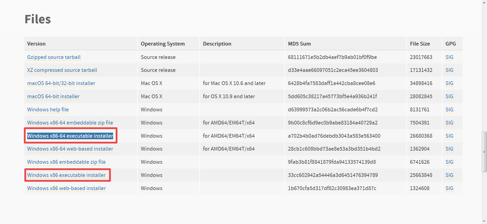  

一般应该选择64位安装，因为32位无法运行很多深度学习软件。

也可以直接点击下载[64位安装](https://www.python.org/ftp/python/3.8.10/python-3.8.10-amd64.exe "64位")或[32位安装](https://www.python.org/ftp/python/3.8.10/python-3.8.10.exe "32位")  

这里**x86, x86-64和AMD64是CPU上的硬件指令集的名称**。其中x86是经典的针对32位CPU的指令集。简单说来它的每一个基本指令可以让CPU处理两个32位二进制数。而x86-64则是AMD公司首先设计出的64位指令集（每个基本指令处理2个64位二进制数），且兼容32位的x86。  

### 安装Python全家桶
当然是先打开刚才下载的exe文件。**不要无脑地直接点下一步哦！**我已经安装了Python 3.7，所以这里用3.8来演示。  
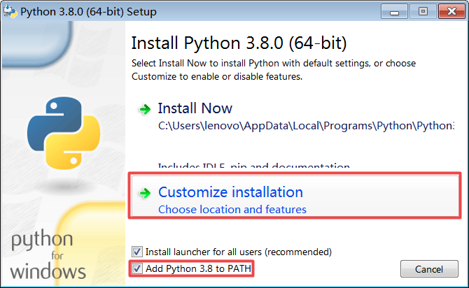  
首先要勾选`Add Python 3.8 to PATH`，然后点击`Customize installation`。接着**全部勾上**：  
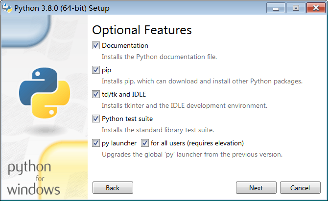  
然后勾选`Install for all Users`和`Download debugging symbols`：
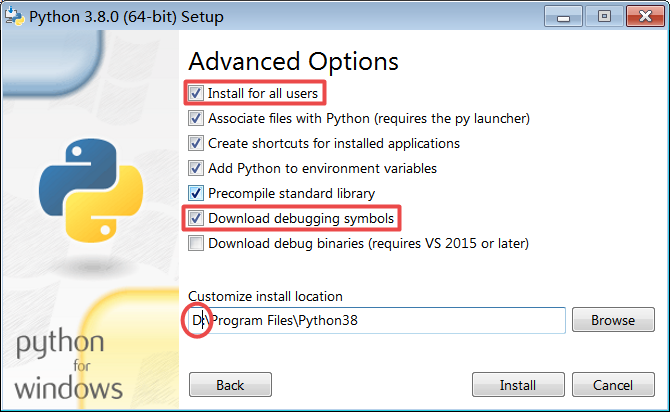
推荐安装在`D:\Program Files\Python37`（C盘空余500GB根本用不完的可以不理我）。推荐不勾选`Download debug binaries`，因为会消耗很长时间下载。点击Install，坐等安装完成。可以先阅读下一节“环境”，但不要急于操作。  

事实上后面的`Path`和`cmd`才是本章重点学习的内容。  

## 环境
我们先问自己一个问题：**程序在运行过程中需要依赖哪些东西？**  

这个问题其实会贯穿程序猿的整个生涯。用面向萌新的话来说，程序需要你的**代码**来提供控制流程。当然，程序还需要**数据**，但我们现在暂时不考虑大规模数据的处理。  

然而问题在于：**电脑怎么知道你的代码在哪里？**    

这个问题看起来简单到了搞笑的地步。然而事实是，**教你的电脑找到你想要运行的东西是非常困难的**。事实上，你在安装Python时需要**设置Path**，否则你的电脑连一个Python程序都无法运行，因为它不知道你安装的Python在哪里。幸好刚才安装器已经帮你设置好了Path，但我们还是有必要看看设置Path意味着什么。  

### Path
**操作以下步骤之前，请确保Python安装器运行完成。**  

右击“计算机”：  

  

点击“属性”：  

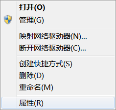  

点击左边的“高级系统设置”：  

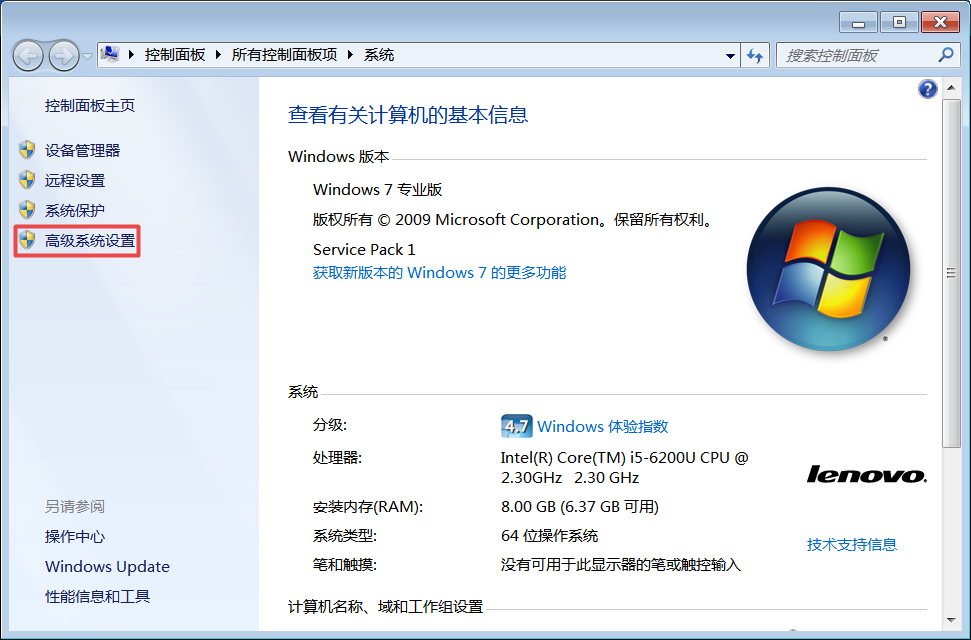  

点击“环境变量”：  

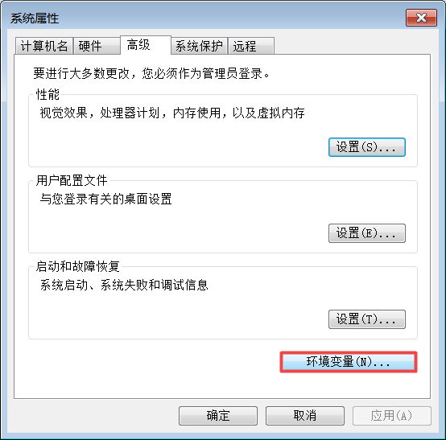  
在下面的框里找到`Path`并点击编辑：  

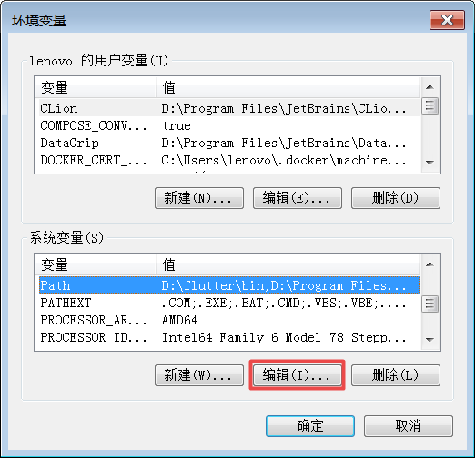  
我们会看到“变量值”里（很可能）有一大堆内容。Win10会把这些内容列成表格。对于Win7用户，我们点击变量值的右边包含实际内容的文本框，然后Ctrl+A（全选），Ctrl+C（复制），然后开一个记事本，Ctrl+V（粘贴），再在记事本中按Home键回到整行行首。这一步最终目标是把变量值的所有内容复制进记事本，便于查找。此时我们在记事本里按Ctrl+F，查找Python：  

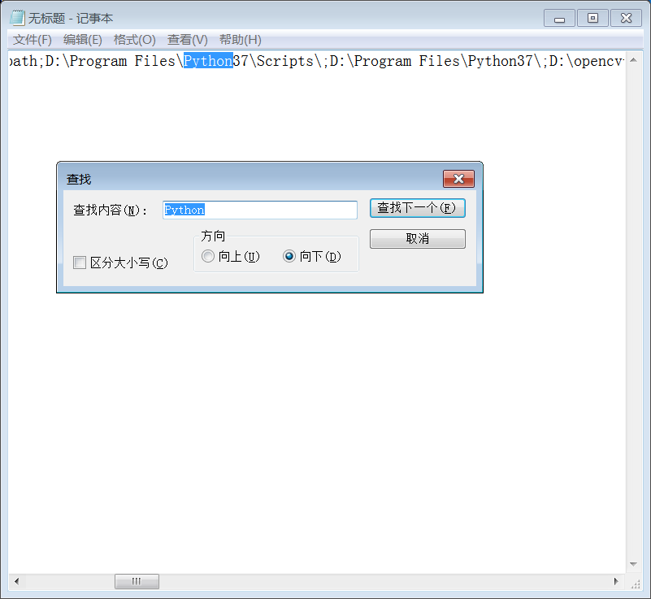  

不出意料的话你的`Path`里有这两项：  

>D:\Program Files\Python37\Scripts\;  
>
>D:\Program Files\Python37\;

32位玩家的`Path`应该是：
>D:\Program Files\Python37-32\Scripts\;  
>
>D:\Program Files\Python37-32\;

如果没有，则你的Python安装器可能没运行完成，或者最初安装时没有勾选`Add Python 3.8 to PATH`。要补救的话直接往系统的Path里加入这两项即可（不用换行）！  

如果打开`D:\Program Files\Python37\`这个文件夹……好的，果然有1mol看不懂的东西。不过我们注意到里面有`python.exe`。此外，`D:\Program Files\Python37\Scripts\`里面有`pip.exe`。确保这两个文件存在即可。  

### cmd
我们试着使用`cmd`（命令窗口）这种程序猿的方式打开文件，来看看`Path`以及“让电脑找到你想运行的东西”到底意味着什么。  

在这篇`README.md`所在文件夹的空白处按住`Shift`并点击鼠标右键，在右键菜单中点击`在此处打开命令窗口`：  

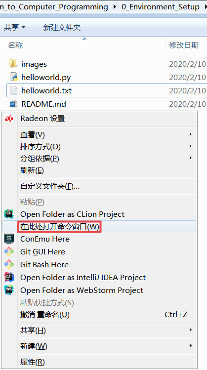  
弹出一个小黑窗口。这个小黑窗口在Linux里对应地称为`Terminal`（终端）。注意**这个黑窗口里点击鼠标右键可以粘贴你复制的文字**。  

#### 第一次运行你的程序！
输入`helloworld.py`，按`Enter`  

（注意你的系统此时应该是默认用Python打开.py文件。如果不是这样，可以改成输入`python helloworld.py`）。  

再输入`python helloworld.txt`，按`Enter`：  

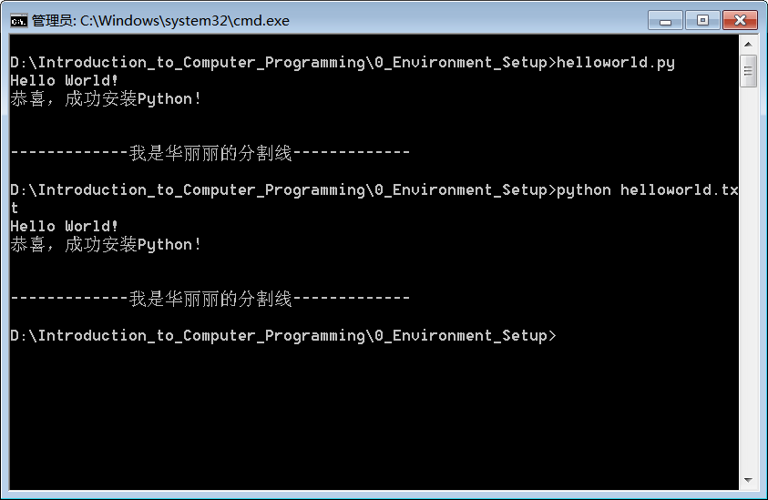  

除了可以使用粘贴外，**小黑窗口还支持自动填充** 。你可以输入`he`然后按`Tab`键。此时你的输入内容就变成了`helloworld.py`。再按一次`Tab`就变成`helloworld.txt`。继续按`Tab`，自动填充功能会在所有以`he`开头的文件名里切换。  

"python 某文件名"的效果是，将某文件名作为Python程序来运行。接下来我们要用各种花式方法来实现“把一个文件作为Python程序来运行”这件事。  
>要让电脑认识python这个命令，需要正确设置Path。  

>电脑认识"python"的实质是，让Path所包含的某个目录内存在`python.exe`这个文件。  

>`python.exe`会把你给它的文本文件（你的文本使用Python语言写成）解释为可运行的机器代码，在硬件上运行。虽然我们一般用.py作为Python程序的后缀名，但.txt或者其他后缀也可以。只要文件内容是正确的Python语言！  

接着我们输入`helloworld.txt`并按`Enter`，发现电脑用记事本打开了`helloworld.txt`。这**相当于双击**。它的内容是：
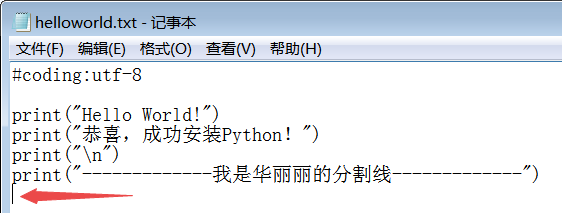  
结论是：  
>在cmd里输入单个文件的全名，就会用Windows默认的方式打开该文件。

但`python helloworld.txt`这件事的结果比较奇怪。为什么没有打开`python helloworld.txt`那个文件？这与命令行的特性，以及Path有关。我们稍后再详解。  

先解释一下这个Python程序：  

>`#coding:utf-8`  
>
>表示这个文件的是以UTF-8编码保存的。如果你给`python.exe`喂一个带有这样开头的文件，则你必须把txt保存为UTF-8编码，而不是记事本默认的ANSI编码。这件事比较麻烦，但幸运的是，我们不会经常使用记事本来编写程序（大佬请随意）。  

>大多数情况下推荐使用UTF-8编码来保存代码文件。  

而  
>`print("随便什么内容")`  
>
>就可以在小黑窗口上输出“随便什么内容”，除非"随便什么内容"里带有奇怪的符号，如`\n`。至于`\n`的含义，日后再解释。  

现在按`Win+R`（`Win`键上面是Windows徽标。这个键应该在你的键盘左下角区域，`Alt`键左边，`Ctrl`键右边），输入`cmd`，按`Enter`。在新弹出的小黑窗口里运行`helloworld.py`，结果是……
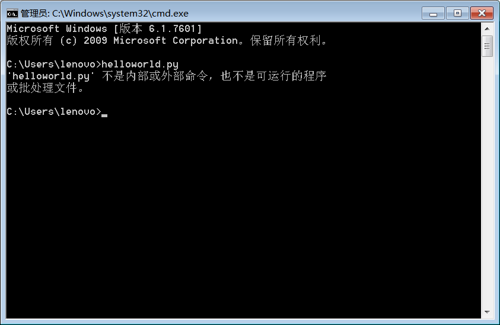
也就是电脑没有找到`helloworld.py`这个文件  

​    

上面的实验中，电脑能运行和不能运行helloworld.py，区别仅在于命令行所指的目录。`D:\Introduction_to_Computer_Programming\0_Environment_Setup`里有`helloworld.py`这个文件，所以电脑顺理成章地找到了它，并且使用系统默认的Python打开了。然而`C:\Users\lenovo`里则当然没有`helloworld.py`。  

所以：
>电脑的`cmd`会在“当前目录”寻找你想要的文件。  

为了验证以上结论，我们在新的小黑窗口里执行这样一连串命令：  
>`D:`  
>
>`cd Introduction_to_Computer_Programming\0_Environment_Setup`  
>`helloworld.py`  

又可以华丽丽地执行之前的Python程序了：  

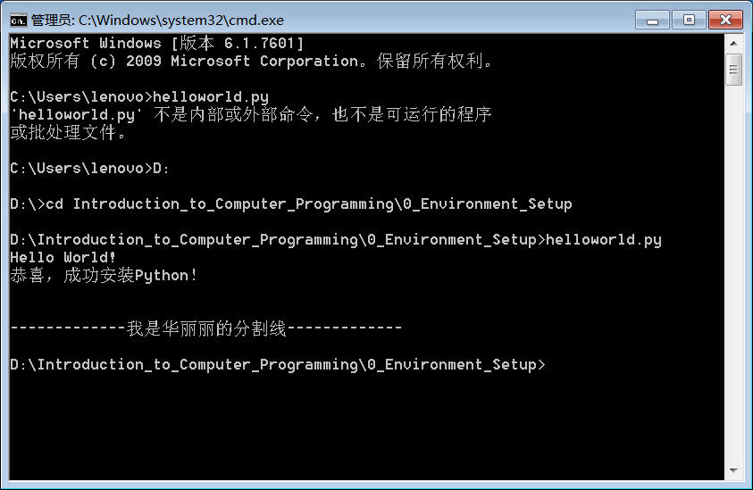  

我们再考虑第一个小黑窗口里`python helloworld.txt`这条命令。为什么它没有打开一个txt文件？  

实际上，它的意思是运行`python.exe`（`.exe`这样的后缀名在不会混淆的情况下可以省略），并给它提供`helloworld.txt`这个“参数”（参数是从程序外部给程序提供的一种指导，会指明程序具体要做的事情。注意参数不一定都是文件名。参数的含义是根据程序本身的运行逻辑决定的。对`python.exe`而言，它可以接受一个文件名参数，作为将要输入的程序代码）。此时`python.exe`会把`helloworld.txt`认为是一个Python程序，并在cmd里输出文字。  

那么`python.exe`在哪里呢？只能是在`Path`所包含的`D:\Program Files\Python37\`里。  

结论是：
>如果在cmd当前所指的目录找不到你输入的文件，则会到Path里所有的目录中去找。Path中排在前面的，优先被搜索。  

>文件名+空格+其他内容 代表打开“文件名”，并提供参数“其他内容”，而**绝不代表**打开“文件名 其他内容”。这是cmd命令的特性。  

你甚至可以试着把系统Path里的`D:\Program Files\Python37\`删掉。这样你的`cmd`就不认识`python`了！**此操作有一定风险。****千万要把Path恢复原状哦！**  

#### 来做更多试验吧！
在指向`D:\Introduction_to_Computer_Programming\0_Environment_Setup`的命令行窗口中：  

`python`

此时你打开了`D:\Program Files\Python37\python.exe`，进入了Python语言的环境。这一行命令的效果等于双击`D:\Program Files\Python37\python.exe`。在Python语言环境中不能使用cmd的语言。我们先退出Python环境：  

`exit(0)`  

此时你退出了Python语言的环境。  

`cd ..`  

此时你的命令行所指目录向上退了一级。

>`cd`表示进入一个目录，`..`表示当前`cmd`所指目录的上一级，而`.`表示cmd当前所指目录本身。    

`0_Environment_Setup\helloworld.py`  

你成功执行了helloworld.py。  

`"D:\Program Files\Python37\python.exe"`  

你又一次进入了Python环境。  

`exit(0)`
`"D:\Program Files\Python37\python.exe" "python helloworld.txt"`  

找不到这个文件或目录  

`"D:\Program Files\Python37\python.exe" "0_Environment_Setup\python helloworld.txt"`
成功运行。  

以下是完整记录：  

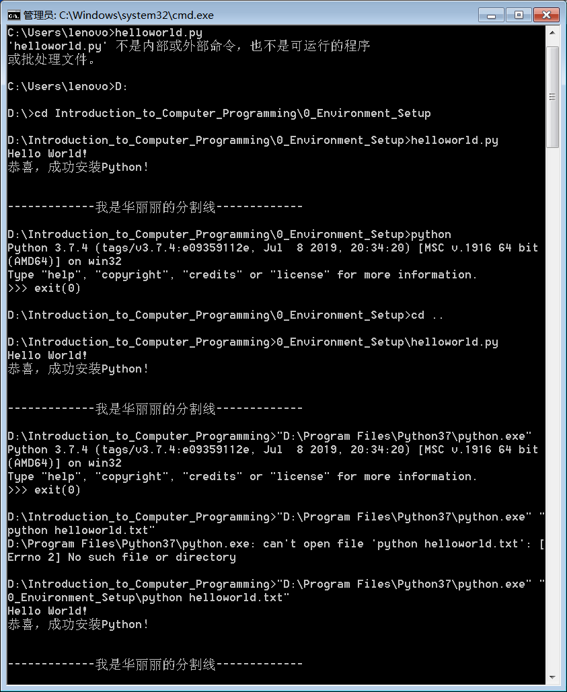  

以及结论：  
>当你向cmd输入一个不含路径的文件名，cmd会先从当前目录去搜索，再到Path里逐个目录搜索。如果你输入的文件名含有路径，则会在那个路径搜索。  

>使用双引号""包住文件名或路径里的空格，否则空格就被解释成提供其他参数了

>你可以用`绝对目录`（`"D:\Program Files\Python37\python.exe"`这样的完整目录）来指明一个文件的位置，也可以使用【相对于命令行当前所指目录的】目录，称为`相对目录`。  

而“环境”的含义也呼之欲出：
>环境就是告诉电脑，它需要的东西在哪。  

以后使用别人编写的程序时，可能不仅会用Path来定义环境，还会使用.conf和.ini文件等。  

## 用正统方法编写程序  
虽然你的程序是个文本文档，理论上可以用各种各样的工具编写，但还是有一些更“合适”的方法，比如……
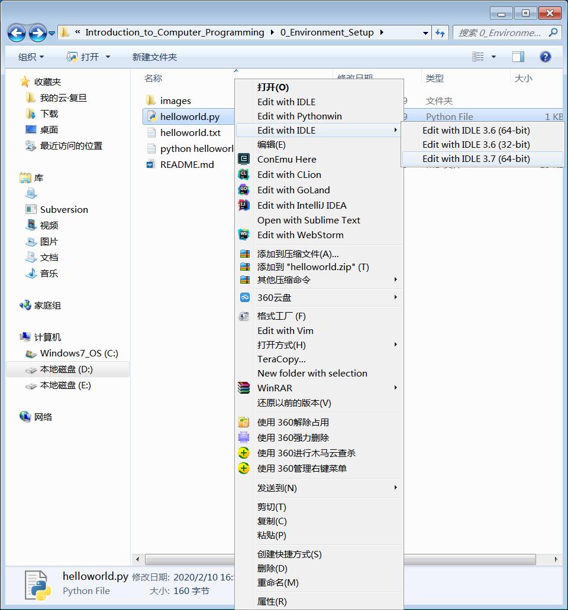  

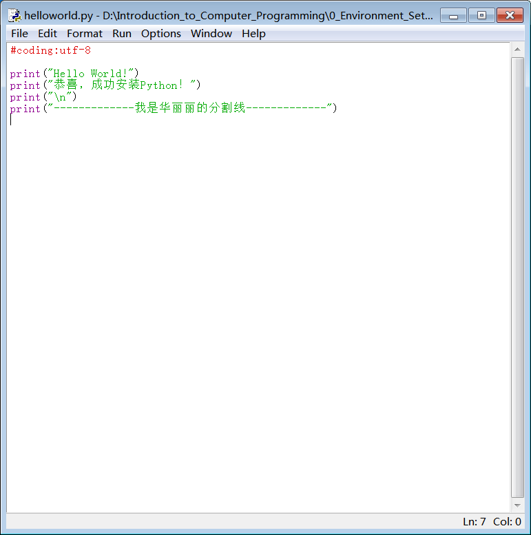  

IDLE是官方附带的编辑器，会对不同类型的词标出不同的颜色，会在右下角显示行号。这个编辑器程序本身也由Python编写，所以你甚至可以改动它的配置，实现你想要的效果。关于它的更多功能，日后再说。  

>由于你写的代码是个文本文件，所以任何你喜欢的文本编辑器都可以用来写代码。因此推荐安装`Sublime Text`（一个文本编辑器）和`PyCharm 2019.3`（一个集成式开发环境）。此外还有`conemu`（一个加强版`cmd`）。  
>   
> 计算机里很多东西不是复杂的0和1，而尽量都是文本内容。这是先辈们经过深思熟虑的坚持，是他们为我们留下的宝贵遗产。  

## 复习  
>在命令行里执行`pip install requests`。  
为什么你的命令行认识`pip`命令？因为`D:\Program Files\Python37\Scripts\`里面有`pip.exe`。  
`install`和`requests`是文件名吗？不是。它们只是你输入的“参数”。根据不同程序的内部逻辑，参数会被解释为不同含义。  

>你向`cmd`输入一个文件名后，`cmd`会如何搜索这个文件名？  

>试着用`cmd`打开你电脑上的各种文件。你可以用`dir`命令列出当前目录下所有文件和文件夹。Linux系统对应的命令为`ls`。  

>试着新建文本文档，把文件名改成英文（中文会遇到各种麻烦），后缀名txt直接改成py，并用IDLE编辑文件内容，写一个Python程序。程序内容为任意print你喜欢的文字。在cmd里执行你写的程序。  

>用IDLE打开hw01.py，随意思考它的逻辑。  

## 预习
下一章将学习Python的基本数据类型，并使用“函数”来包装你的代码。  