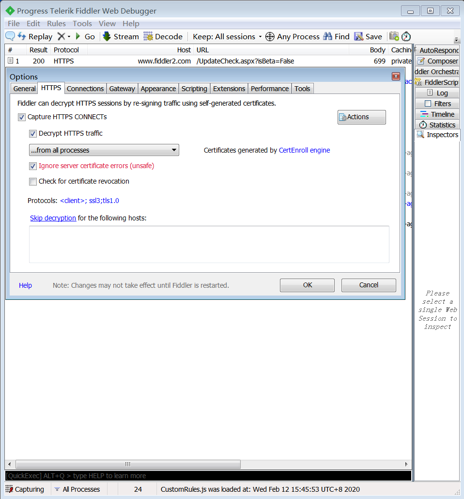
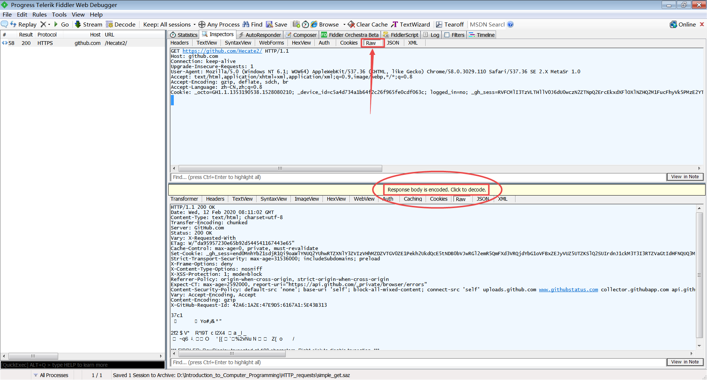
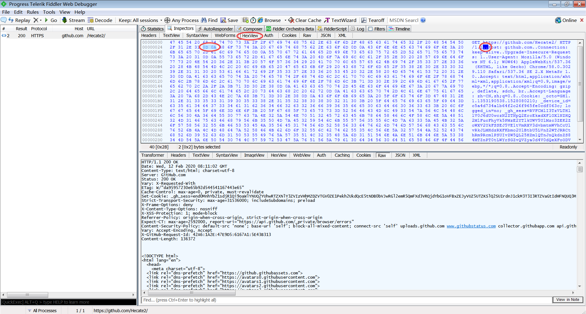
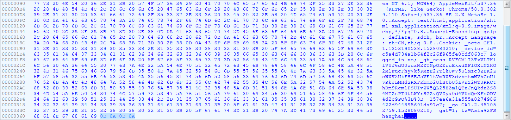

# HTTP  
本章将简单介绍HTTP通信的底层原理，带你使用Python的requests库发起客户端HTTP请求，顺便建立对前端、后端的基本概念。  
  
## 配置环境和软件  
很不幸，我们又得配置东西了。请确保你已经安装：  

1. Python的`requests`库 (`pip install requests`)  
2. 正统的网络浏览器，例如Chrome和Firefox。在你的浏览器设置中确保浏览器使用IE的代理（也就是Windows系统的代理）（这不是让你使用IE浏览器上这节课！）  
3. [Fiddler](https://www.telerik.com/fiddler) (<-点击直接跳到官网，不过连接速度可能有点慢。)  
4. 愿意阅读可能有点枯燥的理论的好心情  
  
最麻烦的可能是Fiddler。我个人感觉Fiddler的安装过程没什么值得说的，不过你需要在菜单栏Tools->Options的HTTPS选项卡里做这样的设置，否则Fiddler就无法捕获HTTPS请求（只能捕获HTTP）了。如果这样还不行，请百度或者问我！  
  
另外建议在Tools->Options里的Connections选项卡，把`Fiddler listens on port:`改成58888。这是为了避免今后你们自己喜欢占用8888端口。暂时不必深入理解“端口”是什么。只要知道端口是你电脑上进行网络访问的虚拟通道，端口号0到65535的整数即可。  
  
## Web服务是如何构建的？  
`python -m http.server 56789`  
  
56789是服务器监听的端口号。  
  
浏览器访问`http://localhost:56789/`;按F12。  
  
浏览器发起HTTP请求时，默认目标服务器监听端口80，发起https请求时默认服务器监听端口443。  
  
前端：浏览器里运行的代码。如何显示界面，如何发起HTTP请求。  
  
后端：服务器里运行的代码。收到HTTP请求以后该如何处理。  
  
## 观察HTTP请求  
假设你打开浏览器访问[https://github.com/Hecate2/](https://github.com/Hecate2/)，请问这个过程中到底发生了什么呢？  
  
简单说来，你的浏览器与github的服务器进行了一些HTTP（Hyper text transfer protocol，超文本传输协议）通信。浏览器向服务器发送了一个请求，而服务器（一般来说）会回答一份HTML文档，于是你的浏览器就可以根据HTML来显示网页了。我们现在就使用Fiddler观察一些HTTP请求吧！  
  
### Fiddler抓取HTTP请求  
**注意，你接下来做的这些事涉及许多安全风险。在你学会之前，不要把你Fiddler抓取的结果随意给别人看。这可能导致你的账号和个人信息被盗。**  
先启动Fiddler，再启动浏览器随意访问网页。正常情况下Fiddler会自动蹦出很多很多条目。每个条目就是你的电脑发起的一个请求，以及对应的服务器响应。**Protocol这一列不仅应有HTTP，还应有HTTPS。没有HTTPS就很可能是不正常的。**  
  
用鼠标圈起条目然后**按Delete就可以删除你不感兴趣的条目**。我删到只剩下图所示的1条（可打开simple_get.saz阅读)。  
  
点击raw选项卡可以阅读浏览器请求（右上框）和服务器响应（右下框）的最原始内容。响应内容是经过gzip编码压缩的，因此要点击红圈红框中的Click to decode来解码到原始文字。  
  
### HTTP请求的底层是什么？  
我们知道在网线、光纤里，或者WiFi的无线电波里只能用电压、光等信号的有无来传输0和1。至于如何解释这些0和1，让电脑理解它们，则是程序猿的工作。当然：  
  
>在能达成目的的前提下，程序猿都喜欢让事情尽量简单。  
  
所以不要因为HTTP通信是一种“奇迹”，就以为它很复杂哦！其实它很简单。  
  
>KISS！  
Keep it stupidly simple.
  
来看看右上角你的浏览器发出了怎样的请求：  
`GET https://github.com/Hecate2/ HTTP/1.1 ……`  
这是一个使用`GET`方法的请求（`GET`方法通常用来向服务器取用HTML文档，或者各种文件、图片等），发往`https://github.com/Hecate2/`这个网址，使用HTTP/1.1协议（其他还有1.0和2.0等）。需要特别说明的是，**你的Fiddler并没有为了让这个请求容易被人读懂，去使用特别复杂的规则来解析底层的0和1**。换句话说，你的Fiddler“什么都没做”，直接把HTTP底层的请求过程当做文字来显示给你看了。事实上，**HTTP简单到了“愚蠢”的地步：大多数时候它发的并不是什么二进制神秘编码，而仅仅是一整条字符串！**这些字符串使用的就是ASCII之类的常用编码。在这次请求中，我们的电脑向服务器发送的仅仅是ASCII编码的字母`G`，然后是`E`，再是`T`。紧接着，电脑发了一个ASCII编码的空格。这之后是你请求的网址（称为 **URL** ）。网址之后的空格再跟着`HTTP/1.1`，表明浏览器期望使用的协议。**这个字符串还未结束**：电脑继续发送两个转义字符`\r\n`表示换行，然后是`Host:……`这样一行一行更多的字符。这些字符称为`header`，中文可能会被译为`标头`或者`头`。理论上header的内容也和功能也是任意的，但header一般用来让客户端向服务器提供额外信息，便于服务器判断客户端的身份等信息，回答更适合客户端的响应内容。浏览器填写header遵循的行为模式是制作浏览器的程序猿们一致商量好并且公开的。我们暂时不用在意每一条header的具体含义。  
  
>整条HTTP GET请求仅仅是一个字符串。一切就是那么简单！  
  
为了确认“Fiddler什么都没做”，我们在HexView里看看HTTP的底层是多么简单：  
  
HexView会把每8位二进制（8个0或1）显示为2个16进制数字（012……89ABCDEF），并且在右边按ASCII码的对应原则，翻译成字符。有的ASCII字符是无法直接显示的（例如圈出来的两个`.`），他们对应16进制的0D和0A。查阅ASCII码表，会发现这两个字正是`\r`和`\n`。最后，如下图所示，**这个HTTP GET请求的字符串以`\r\n\r\n`，也就是2个换行来结束。**  
  
  
现在我们来举一反三。已知HTTP协议有GET, POST, HEAD, PUT, DELETE, CONNECT, OPTIONS, TRACE等方法。**如果电脑要用POST方法发请求，它应该怎么做？**  
  
答案简单到令人发指：基本上仅仅是改掉字符串里的一个词，也就是把`GET`三个字改成`POST`四个字！  
  
不过，`POST`方法还允许你做更多的事。它的结尾可以不是`\r\n\r\n`，而是`\r\n你想告诉服务器的内容`（不一定由`\r\n`结尾）。这个`你想告诉服务器的内容`可以是任意文字或二进制内容（文件、图片等）（反正文字也是由二进制编码）。发送“你想告诉服务器的文字”时，甚至不一定必须使用ASCII编码。这是因为，“你想告诉服务器的内容”与HTTP本身并无关系。HTTP只是一种通信协议，是为更上层的应用打基础。**所以你POST的东西可以是文字或任意二进制内容。只要是客户端和服务器商量好的，都能读懂的内容就可以！**但之前的**`header` 部分按规定只能用ASCII**，为处理HTTP通信的底层程序提供方便。  
  
再看看服务器的应答：  
`HTTP/1.1 200 OK ……`  
也就是说服务器确认使用`HTTP/1.1`协议，且状态码为`200`（如果你请求了奇怪的网页，这个状态码也可能是404或者其他）。对这个状态码的文字说明是`OK`。需要注意的是，200或者404是三个使用ASCII编码的字符，而不是一个整数。理论上状态码也是可以任意填写的，但这需要客户端和服务器的程序猿们商量一致。状态码和header一样有某种规范或者惯例。  
  
>到这里我们其实已经理解了HTTP的底层：基本上就是字符串。  
  
目前我们对浏览器们的行为不甚了解，但浏览器内部的复杂性堪比一个操作系统。关于浏览器通常的行为、header、状态码和各种HTTP方法的详解，可见于：  
>[https://developer.mozilla.org/zh-CN/](https://developer.mozilla.org/zh-CN/)  
  
Mozilla正是开发火狐浏览器的组织。只要懂了HTTP，Mozilla的这些文档应该都不难读懂。如果读不懂，请递归地去搜索你没理解的那个词。如果还是没懂，那就是对浏览器的行为规范缺乏了解。你可以先可以试着读读：
>[https://developer.mozilla.org/zh-CN/docs/Web/HTTP/Status/](https://developer.mozilla.org/zh-CN/docs/Web/HTTP/Status/)  
  
这篇文档提供了关于状态码的信息。其中也会暗含一些浏览器的行为规范，例如服务器回答状态码302一般表示让浏览器转而访问另一个网址，又比如浏览器会有缓存。**如果中文晦涩难懂的话，英文应该会更简单一些！**  

……    
  
好吧我知道你很可能还是看不懂。没关系，这很正常。通常是在某一方面有基础知识，有一定实力的程序猿才有啃文档的勇气。更有很多文档恶心到根本没人看得懂。然而**最恶心的莫过于一个庞大的程序没有文档，也没有注释**。  
  
上述的mozilla提供的文档在你今后开发Web程序（前端、后端）时也会很有用。在本课程的后期，我们会慢慢地学习啃文档。  
  
## 浏览器里的世界  
前端：以Google Chrome为例，浏览器里F12，`Console`执行JavaScript。  
  
浏览器的user-agent，cookie  
  
requests.Session()能为你自动保存cookie  
  
## 爬虫：发起你自己的HTTP请求  
我们要编写程序来发起HTTP请求了。借助你自定义的HTTP请求，你可以快速大量收取网上的数据，或者自动化地完成一些操作。是不是很激动呢？  
  
爬虫需要前端、后端、HTTP的知识，以及逆向工程的能力。写爬虫的大多数时候是在做逆向工程以及洗数据，而不是在写与HTTP请求相关的代码。  
  
本节的内容比较偏实践。我们的主角是Python中著名的第三方库`requests`。不过，由于使用`requests`简单到令人发指，所以本节的难点实际上在于洗出数据，也就是从请求获得的HTML里找出你想要的东西。在此我们使用`AdvancedHTMLParser`和正则表达式`re`  
  
### 爬取nCoV病毒的感染者数据  
  
### 爬取贴吧一个帖子里所有的图  
  
## 比HTTP更底层的内容  
本节内容可能稍微有点枯燥，但会成为许多东西的重要基础。  
  
  
（图片来自`https://www.cnblogs.com/mike-mei/p/8548238.html`）  
上图看起来非常复杂。幸好我们现在只需要理解很小一部分内容。  
  
### Socket  
应用层的底层：一个复读机。HTTP要求发什么字符串，它就复读什么字符串。交给更底层的东西完成通信。  
`GET / HTTP/1.1\r\nHost: www.baidu.com\r\nConnection: close\r\n\r\n`  
参考：`https://www.jianshu.com/p/f5a5db039737`  
  
### TCP  
SYN, ACK，2^32，+1  
HTTP/1.1与requests.Session()：多个HTTP请求建立于在一个tcp连接上。  
  
### IP地址  
逻辑地址。**与网络拓扑结构有关。**  
  
### 端口  
网络中的数据包会记录发件人和收件人的IP地址和端口号。数据包到达收件人后，收件人的机器检查这个数据包要发给哪一个端口。将数据包交给监听这个端口的程序（应用层）进一步处理。  
端口只是一个0-65535的数值，不代表真实的物理接口。  
  
### MAC地址  
物理地址。数据链路层和应用层。每个网络设备有唯一MAC地址。**与网络设备制造商有关。**  
  
### ARP  
Address Resolution Protocol，根据IP地址获取MAC地址。  
局域网路由器向整个网络大喊：我要找IP地址为192.168.1.123的机器！  
被分配了IP地址192.168.1.123的机器回答：我的MAC地址是0A-11-22-33-44-01。 
两台机器的网卡由此建立物理通信。  
路由器缓存一条ARP条目：{192.168.1.123 : 0A-11-22-33-44-01}  
  
### 路由协议  
向其他设备转发网络请求包，试图让请求到达正确的IP地址。  
MAC地址没有路由协议。**如果只有MAC地址而没有IP地址，则全世界每个设备两两之间必须在物理层上直接连接，且每次建立通信需向全世界广播。**但借助IP地址和路由协议，不直接相连的两台机器也可以通信  
  
TTL(Time To Live)  
  
## 反爬虫  
大多数时候写爬虫实为逆向工程：人工推导前后端的工作流程，构建HTTP请求流程以完成你想做的事。可以通过大幅增加逆向工程的成本来反爬虫。  
另外还可以设置一些机器不会做，只有人会做的的事，来阻止机器行为。  
  
### user-agent?  
单纯基于header的反爬虫其实没啥用。HTTP库设置header很容易。  
  
### 验证码  
机器不认识图片中的文字！  
  
### JavaScript  
Python的`requests`，以及所有编程语言的所有HTTP库都不能执行JavaScript！但浏览器可以执行。  
`AJAX`：让浏览器使用JavaScript发起请求  
请求中带加密参数  
浏览器指纹  
  
### APP内部加密  
请求中带加密参数，且加密过程不使用JavaScript，而是封装在其他程序里。  
  
### http底层特征识别  
IP, MAC, TTL, ……，大数据和机器学习综合判断  
  
## 发起攻击！  
请不要真的攻击别人的服务器。  
### 流量式DDOS  
普通地发射流量；Memcached反射放大  
### SYN Flood（TCP协议层）  
发起大量伪造的TCP连接  
### Slowloris（应用层）  
发起大量真实连接，但攻击方socket输出速度很慢。服务器连接池被占满  
### ARP欺骗
一个局域网内，机器1要与机器2通信，机器1向整个局域网广播，被机器3抢先应答：我就是机器2。  
机器2断网。  
### 与后端代码逻辑相关的攻击  
其实这和HTTP没有直接关系。利用漏洞进行渗透：窃取数据/从删库到跑路  
  
## 防御  
云服务器，Cloudflare  
  